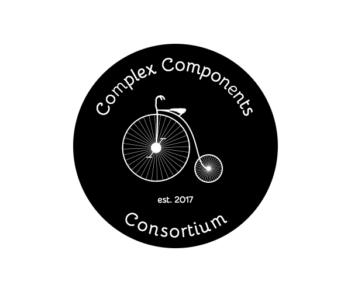

# Complex Component Consortium

The `Complex Component Consortium` is an association working to improve the usability of [FOSS](https://en.wikipedia.org/wiki/Free_and_open-source_software) by providing high level user interface components.

If you want to make a FOSS [slack](https://slack.com/) clone, it is our mission to provide you with a `chat` component that can preview links, include a spotify player, show emojis and all the rest - fully customizeable to your needs and underlaying platform.

## Mission statement

## Complex Components

## Technologies

## Example

## Future work
